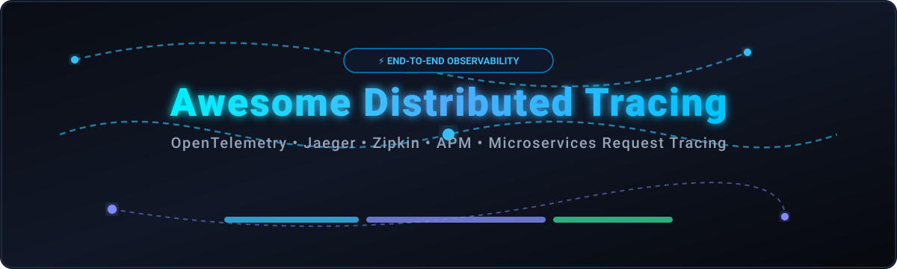
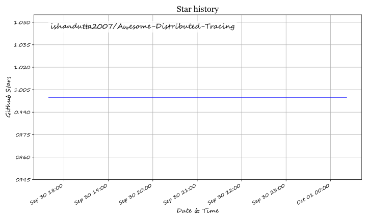

  

  
  
  
  

# 🔍 Awesome Distributed Tracing

> 🚀 A curated list of top SaaS products, Application Performance Monitoring (APM) tools, and open-source projects for **Distributed Tracing**, **OpenTelemetry**, **Microservices Observability**, **Span Analysis**, and **Service Maps**.

---

## 📊 Overview & Market Context

**Distributed Tracing** is an essential capability within modern cloud-native microservice architectures. By tagging and propagating context across microservices, API gateways, serverless functions, message queues (Kafka, RabbitMQ), and databases, distributed tracing enables SREs, platform engineers, and developers to analyze request latency, pinpoint root causes of failure, and map complex distributed service dependencies in real time.

---

## 📋 Table of Contents

- [📊 Market Overview & Sector Analysis](#-market-overview--sector-analysis)
- [☁️ SaaS & Hosted Observability Platforms](#%EF%B8%8F-saas--hosted-observability-platforms)
- [🔓 Open-Source Distributed Tracing Projects](#-open-source-distributed-tracing-projects)
- [🏗️ Architectural Patterns & Stack Selection](#%EF%B8%8F-architectural-patterns--stack-selection)
- [🤝 How to Contribute](#-how-to-contribute)
- [💖 Support & Community](#-support--community)
- [📈 Star History](#-star-history)
- [⚠️ Disclaimer & Best Practices](#%EF%B8%8F-disclaimer--best-practices)

---

## 📈 Market Overview & Sector Analysis

The global Application Performance Monitoring (APM) and Distributed Tracing market is estimated at **$5.2 Billion in 2024** and is projected to reach **$12.8 Billion by 2030** (growing at a CAGR of ~15%).

The sector is **moderately fragmented**. Established cloud software giants (Cisco/AppDynamics/Splunk, ServiceNow, Datadog, Dynatrace) control major enterprise market share with AI-assisted root cause analysis (RCA) and full-stack observability suites, while specialized observability vendors (Honeycomb, Grafana Labs) and vendor-neutral open standards (**OpenTelemetry**) empower engineering teams to decouple telemetry collection from analysis backends.

---

## ☁️ SaaS & Hosted Observability Platforms

Commercial APM and distributed tracing platforms offer managed scalability, high-cardinality indexing, turnkey machine learning anomaly detection, and enterprise SLAs.

*Note: Platforms are sorted by company size / market valuation in descending order.*

| Platform / SaaS Product | Company Size / Valuation | Pricing (Starting Tier) | Free Tier Limit | Key Tracing Capabilities |
| :--- | :--- | :--- | :--- | :--- |
| **[Cisco AppDynamics](https://www.appdynamics.com/)** | **~$200B Market Cap** *(Cisco)* | $60 / CPU core / year ($5/core/mo) for Infrastructure; $90 / agent / mo for APM | 15-day free trial (transitions to restricted Lite Edition afterwards) | Enterprise APM & full-stack observability with deep agent-based transaction tracing and business health monitoring. |
| **[ServiceNow Cloud Observability](https://cloudobservability.servicenow.com/)** *(formerly Lightstep)* | **~$180B Market Cap** *(ServiceNow)* | $0.15 per 1,000 trace spans or $25 / host / month | 30-day free trial with unlimited trace span ingestion | High-cardinality distributed tracing and change analysis built natively on OpenTelemetry standards. |
| **[Datadog APM](https://www.datadoghq.com/)** | **~$40B Market Cap** | $31 / host / month (APM Pro) or $40 / host / month (APM Enterprise) | 14-day free trial with full platform access (up to 5 hosts) | Full-stack cloud monitoring & APM with end-to-end request tracing, live process tracking, and automated service maps. |
| **[Splunk Observability Cloud](https://www.splunk.com/en_us/products/observability-cloud.html)** | **~$28B Valuation** *(Cisco acquisition)* | $55 / host / month (billed annually) for Splunk APM | 14-day free trial with unlimited data ingest for trace analysis | Real-time streaming APM and distributed tracing for enterprise microservices with AI-driven directed troubleshooting. |
| **[Dynatrace](https://www.dynatrace.com/)** | **~$15B Market Cap** | $0.08 / hour per 8 GB host (~$58.40/host/month) for Full-Stack Monitoring | 15-day free trial with 1,000 host-hours included (no credit card required) | AI-powered full-stack observability platform featuring automatic instrumentation and causal root-cause analysis. |
| **[Elastic Cloud APM](https://www.elastic.co/apm)** | **~$9B Market Cap** | $95 / month (Standard tier on Elastic Cloud, based on RAM & storage allocation) | 14-day free trial on Elastic Cloud (plus free self-hosted basic tier) | Open and extensible APM platform built on the Elastic Stack with OpenTelemetry-native trace collection and search. |
| **[New Relic](https://newrelic.com/)** | **~$6.5B Valuation** | $49 / additional standard user / month (plus $0.35/GB for data ingest beyond free limit) | Free Forever tier with 100 GB/month data ingest and 1 full-platform user free | All-in-one observability platform offering full-stack distributed tracing, log management, and APM capabilities. |
| **[Grafana Cloud](https://grafana.com/products/cloud/)** *(Tempo)* | **~$6B Valuation** | $29 / month (Pro plan, includes 50 GB traces, $0.50/GB additional trace metrics) | Free Forever plan with 50 GB traces/month, 50 GB logs, 10k series metrics, and 3 users | Fully managed enterprise observability platform powered by Grafana Tempo, Loki, and Prometheus. |
| **[Honeycomb](https://www.honeycomb.io/)** | **~$500M Valuation** | $130 / month (Pro plan, includes 100 Million events/month) | Free Forever plan with 20 Million events/month, 2 team seats, and 60-day data retention | High-cardinality observability platform engineered specifically for complex distributed tracing and debugging. |

---

## 🔓 Open-Source Distributed Tracing Projects

Open-source distributed tracing tools offer full data sovereignty, zero per-host trace licensing fees, and vendor independence.

*Note: Projects are sorted by GitHub Stars_Count in descending order. Click any Stars_Badge to inspect the repository's stargazers.*

1. **[SigNoz](https://github.com/SigNoz/signoz)**  
     
   ⚡ Open-source observability platform built on ClickHouse. Native OpenTelemetry support for traces, metrics, and logs with unified filtering and dashboarding.

2. **[Apache SkyWalking](https://github.com/apache/skywalking)**  
     
   ⚡ CNCF APM system designed for microservices, cloud-native, and container-based architectures. Features polyglot auto-instrumentation agents and service mesh observability.

3. **[Jaeger](https://github.com/jaegertracing/jaeger)**  
     
   ⚡ CNCF graduated distributed tracing platform originally created by Uber. Provides end-to-end request tracking, contextual propagation, and adaptive sampling.

4. **[Zipkin](https://github.com/openzipkin/zipkin)**  
     
   ⚡ Pioneer distributed tracing system originally developed by Twitter. Features a lightweight architecture, broad library ecosystem, and battle-tested production history.

5. **[Pinpoint](https://github.com/pinpoint-apm/pinpoint)**  
     
   ⚡ APM tool designed for large-scale distributed Java, PHP, and Python systems. Uses bytecode instrumentation to trace transaction flow with minimal overhead.

6. **[Grafana Pyroscope](https://github.com/grafana/pyroscope)**  
     
   ⚡ Continuous profiling platform integrated with distributed tracing to analyze CPU, memory, and line-of-code execution bottlenecks alongside request trace spans.

7. **[HyperDX](https://github.com/hyperdxio/hyperdx)**  
     
   ⚡ Developer-friendly open-source observability platform integrating distributed traces, log streams, metrics, and session replays in a unified UI.

8. **[OpenTelemetry Collector](https://github.com/open-telemetry/opentelemetry-collector)**  
     
   ⚡ CNCF standard proxy component that receives, processes, filters, batch-samples, and exports telemetry data across vendor-neutral backends.

9. **[OpenLLMetry](https://github.com/traceloop/openllmetry)**  
     
   ⚡ Open-source observability framework for LLM applications and AI agents, building OpenTelemetry trace extensions for OpenAI, Anthropic, LangChain, and vector stores.

10. **[Pixie](https://github.com/pixie-io/pixie)**  
      
    ⚡ eBPF-powered code-free observability for Kubernetes. Automatically captures network requests, service maps, and distributed traces without manual SDK integration.

11. **[Grafana Tempo](https://github.com/grafana/tempo)**  
      
    ⚡ High-scale, cost-effective distributed tracing backend designed for object storage (S3, GCS) and seamless integration with Grafana visualization.

12. **[Uptrace](https://github.com/uptrace/uptrace)**  
      
    ⚡ Open-source APM tool powered by OpenTelemetry and ClickHouse. Detects bottlenecks, highlights error traces, and sends latency alerts.

---

## 🏗️ Architectural Patterns & Stack Selection

- 🌐 **Universal Instrumentation Layer**: Standardize codebases on **[OpenTelemetry SDKs](https://opentelemetry.io/)** to avoid vendor lock-in.
- ⚙️ **Pipeline Processing**: Deploy the **OpenTelemetry Collector** to handle trace sampling, PII redaction, and multi-destination routing.
- 🛠️ **Open-Source Self-Hosted**: Combine **OpenTelemetry Collector** $\rightarrow$ **Grafana Tempo** / **Jaeger** / **SigNoz** for full data privacy and zero trace volume fees.
- ☁️ **Commercial SaaS**: Export OpenTelemetry data directly to **Datadog**, **Honeycomb**, **New Relic**, or **Dynatrace** for advanced AI root-cause analysis and automated anomaly alerting.

---

## 🤝 How to Contribute

1. 🍴 Fork this repository.
2. 📝 Add your SaaS product or Open-Source project to `README.md` following the existing format and sorting order.
3. ⭐ Ensure open-source projects include Stars_Count badges linked to stargazers and SaaS entries include explicit pricing and free tier terms.
4. 🚀 Submit a Pull Request with a clear description of the project.

---

## 💖 Support & Community

Thank you for visiting and supporting the **Awesome Distributed Tracing** repository! If you find this curated resource helpful for your SRE or platform engineering stack, please consider:

- 🌟 **Starring** the repository on GitHub
- 🔀 **Forking** and contributing missing tools
- 📢 **Sharing** with your developer and DevOps communities
- ☕ **Sponsoring / Buying a Coffee**: Support ongoing maintenance via the [GitHub Sponsor Dashboard](https://github.com/sponsors/ishandutta2007)

---

## 📈 Star History

---

## ⚠️ Disclaimer & Best Practices

- 📌 **Community Curated**: This list is community-maintained and intended for informational purposes.
- 🔒 **Data Privacy**: Request traces may contain sensitive payload data or header credentials. Implement tail sampling, span attribute masking, and retention limits.
- 💰 **Cost & High Cardinality**: Tracing millions of requests with unbounded attributes can create significant storage and network overhead. Design sampling strategies according to traffic volume.

---

  <i>Maintained with ❤️ for SREs, Platform Engineers, and Cloud Architects.</i>

## Star History

<a href="https://star-history.com/#ishandutta2007/Awesome-Distributed-Tracing&Timeline" align="center">
  <picture>
    <source media="(prefers-color-scheme: dark)" srcset="assets/ishandutta2007_Awesome-Distributed-Tracing_growth.svg">
    
  </picture>
</a>
